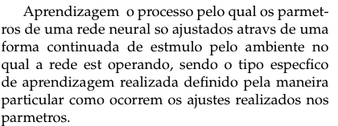
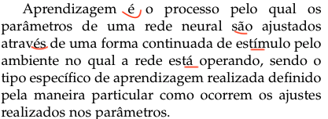
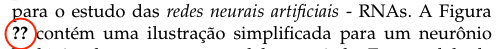
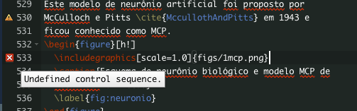
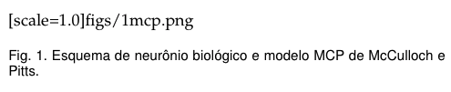
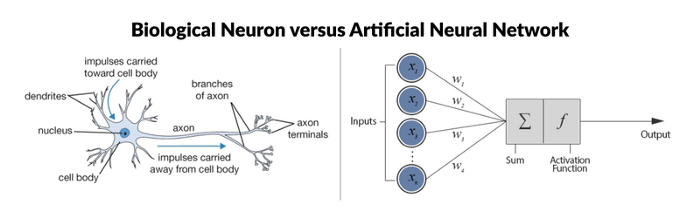
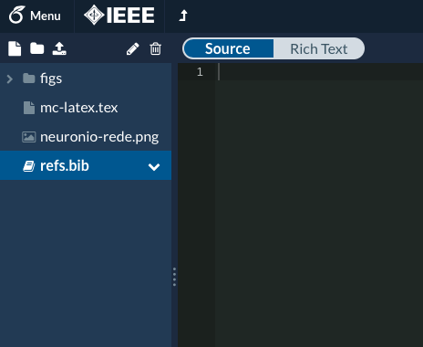
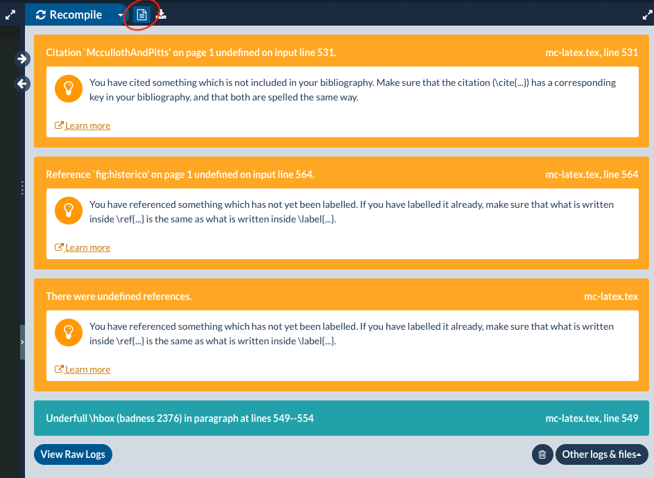

### TRABALHANDO NA SEÇÃO `INTRODUÇÃO`...
--

##### Passo 1: Criar projeto a partir de _template_

- Acessar [overleaf.com](overleaf.com) e criar uma conta com seu e-mail usual.
- Criar um novo projeto: `New Project > Academic Journal`. 
- Utilize a tag `IEEE Official Templates` ou busque pelo _template_ `IEEE Demo Template for Computer Science Journals`.
- Abra como um projeto novo.

##### Passo 2: Observar e customizar interface 

- Observar interface e ambientes: 
	- Área do arquivo-fonte: `Source`/`Rich text`
	- Área do arquivo compilado: `Recompile`/`Logs & Outputs`/`Download PDF`
	- Área de inspeção/navegação: `New File`/`New Folder`/`Upload`/`Rename`/`Delete`
- Observar botões
	- `Menu`
	- `Link para Journal`
	- `Botão raiz`
	- `Review`
	- `Share`
	- `Submit`
	- `History`
	- `Chat`

- Customizar
	- Sincronização (opcional) 
	- Configurações (padrão) 
		- Compilador: `pdfLaTeX`
		- Documento principal: `NOME.tex`
		- Verificação ortográfica: `Portuguese (Brazilian)`
		- Autocompletação: `On`
		- Fechamento automático de parênteses: `on` (opcional) 
		- Verificação de código:
		- Tema do editor: `mono industria` (minha preferência)
		- Keybinding: `none` (para quem é _hardcore_, pode-se usar comandos de tecla do Vim ou Emacs) 
		- Tamanho de fonte: `12px`
		- Família de fonte: `Monaco` (minha preferência)
		- Altura de linha: `Normal`  (minha preferência)
		- Visualizador de PDF: `Built-in` 
		- Teclas de atalho: predefinições
			- Mais úteis (No macos!)
				- Recompilar: `Cmd + Enter` 
				- Comentar: `Cmd + /` 
				- Localizar: `Cmd + F`
				- Desfazer: `Cmd + Z`
				- Refazer: `Cmd + Y`
				- Autocompletar: `Tab`

##### Passo 3: Fazer uma visão geral do arquivo fonte
- Estrutura do arquivo
- Linhas comentadas: `%...` 
- Linhas de comando: `\nome...`
- Linhas de texto puro: `Esta linha contém apenas texto puro.`
- Blocos de instruções: `\begin{nome_bloco}...\end{nome_bloco}`
- Linhas com comandos e texto: `\hfill mds`
- Artigo compilado + botão de tela cheia.


##### Passo 4: Verificar estruturas importantes

```latex
\documentclass[10pt,journal,compsoc]{IEEEtran}
% Esta parte é chamada de PREÂMBULO
% Aqui você importa pacotes e define comandos
% necessários para o seu documento.

\begin{document} 
% Esta parte é a PRINCIPAL, onde você efetivamente
% inserirá o corpo do texto e elementos pré-textuais, 
% textuais e pós-textuais.
\end{document}

% Esta parte é uma ``ZONA MORTA`` e será 
% completamente ignorada pelo compilador. 
```

##### Passo 4: Renomear o projeto e o arquivo principal

- Renomeie para `mc-latex-SEU_NOME`.
- Renomeie o arquivo principal `bare_jrnl_compsoc.tex` para `mc-latex-edit.tex`, se desejar.  

##### Passo 5: Alterar o tamanho da fonte do texto

- Altere a opção `10pt` para `12pt` e recompile.
- Note que apenas o corpo de texto é alterado. Por quê? (Demais elementos são controlados pela classe `IEEEtran`!). 
- `IEEEtran` é um arquivo com extensão `.cls`. Representa uma _classe_ onde aspectos do texto são controlados (similar a um CSS).
- Para outras opções, verificar a ajuda da classe e/ou metadados. Por exemplo, vemos estas informações no início do aqruivo.

```latex
%% bare_jrnl_compsoc.tex
%% V1.4b
%% 2015/08/26
%% by Michael Shell
%% See:
%% http://www.michaelshell.org/
%% for current contact information.
%%
%% This is a skeleton file demonstrating the use of IEEEtran.cls
%% (requires IEEEtran.cls version 1.8b or later) with an IEEE
%% Computer Society journal paper.
%%
%% Support sites: <---------- CONSULTE AQUI!
%% http://www.michaelshell.org/tex/ieeetran/
%% http://www.ctan.org/pkg/ieeetran
%% and
%% http://www.ieee.org/
```
- O arquivo de classe é ocultado pelo `Overleaf`.
- Retorne para `10pt` e recompile. 
- **Suplemento:** 
	- veja a diferença entre arquivos de classe (`.cls`) e arquivos de estilo (`.sty`) [aqui](https://tug.org/pracjourn/2005-3/asknelly/nelly-sty-&-cls.pdf).
	- Para compilar o arquivo localmente em seu computador, você deverá contar com uma distribuição Tex que contenha a classe `IEEEtran`. Por exemplo, no UNIX, seria algo como: `/usr/share/texlive/texmf-dist/tex/latex/IEEEtran/IEEEtran.cls`.

##### Passo 6: Escrever introdução de nosso artigo

- Copiar o texto de introdução do arquivo `misc/conteudo.txt` 
no arquivo do Overleaf.

```latex 
% INTRODUÇÃO 
\IEEEraisesectionheading{\section{Introdução}\label{sec:introducao}}

O cérebro humano contém em torno de 10\textsuperscript{11} neurônios. 
Cada um deles processa informações e se conecta com 
outros milhares de neurônios continuamente ou de modo 
paralelo. A estrutura individual de suas conexões e 
o comportamento conjunto destes nós naturias formam 
a base para o estudo das \textit{redes neurais artificiais} - RNAs.
A Figura \ref{fig:neuronio} contém uma ilustração simplificada
para um neurônio biológico. bem como seu modelo associado. 
Este modelo de neurônio artificial foi proposto por 
McCulloch e Pitts \cite{MccullothAndPitts} em 1943 e 
ficou conhecido como MCP.

\subsection{Aprendizagem: o perceptron}

RNAs possuem a capacidade de aprender por exemplos e tomar 
decisões sobre aquilo que aprendem. Para tanto, necessitam 
de um conjunto de procedimentos bem definidos que adaptam 
seus parâmetros, ou seja, um \textbf{algoritmo de aprendizagem}. 
Dessa maneira, define-se que

\begin{quotation}
Aprendizagem é o processo pelo qual os parâmetros de uma rede
neural são ajustados através de uma forma continuada de estímulo
pelo ambiente no qual a rede está operando, sendo o tipo específico 
de aprendizagem realizada definido pela maneira particular 
como ocorrem os ajustes realizados nos parâmetros.
\end{quotation}

Desde a década de 1940, muito se aperfeiçoou na compreensão 
das redes artificiais. Em 1958, Frank Rosenblatt introduziu 
um novo modelo para o neurônio biológico formado por duas
unidades básicas: os \emph{nós} MCP e uma regra de aprendizado.
Este modelo foi denominado \texttt{perceptron}, o qual é utilizado
até hoje. Então, de meados da década de 1970 para cá, grande
progresso foi atingido com aprendizagem de máquina. 
Vejamos, por exemplo, a linha do tempo mostrada na 
Figura \ref{fig:historico}. 
```

##### Passo 7: Compreender os novos comandos: 
- `\section` (nova seção em nível 1)
- `\label` (referência cruzada)
- `\textsuperscript` (sobrescrito)
- `\textit` (itálico)
- `\ref` (referência)
- `\cite` (referência bibliográfica)
- `\subsection` (subseção em nível 2) 
- `textbf` (negrito)
- `\begin{quotation} ... \end{quotation}` (citação)
- `\emph` (ênfase)
- `\texttt` ($\texttt{typewriter text}$)
- Nota: O comando especial `\IEEEraisesectionheading` eleva o cabeçalho da introdução. 
**Suplemento:** legibilidade de código. Convenção (`sec:`; `fig:`; `eq:`, `tab:`, etc.)


##### Passo 8: Verificar encoding



- O template não compreendeu caracteres latinos? O que fazer? 
- **Inserir no preâmbulo:** `\usepackage[utf8x]{inputenc}` 
- Recompilar e verificar se está OK.

```latex
\documentclass[10pt,journal,compsoc]{IEEEtran}
\usepackage[utf8x]{inputenc} % <===
```




##### Passo 9: Inserir figura `1mcp.png` 

- Note no texto que a referência para a Figura do neurônio está indefinida.



- Corrija inserindo a figura e indicando a `label`.

```latex
A Figura \ref{fig:neuronio} contém uma ilustração simplificada
para um neurônio biológico. bem como seu modelo associado. 
Este modelo de neurônio artificial foi proposto por 
McCulloch e Pitts \cite{MccullothAndPitts} em 1943 e 
ficou conhecido como MCP.
%% INSIRA FIGURA APÓS ESTE PARÁGRAFO
\begin{figure}[h!]
  \includegraphics[scale=1.0]{figs/1mcp.png}
  \caption{Esquema de neurônio biológico e modelo MCP de 
  McCulloch e Pitts.}
  \label{fig:neuronio}
\end{figure}
```
- Verifique se o caminho para a figura está correto, assim como
o nome do arquivo.

- Você notará o seguinte erro de `Undefined control sequence`.



- No documento compilado, você não verá a figura a menos que corrija o problema.



- Como corrigir o problema? 
- **Inserir no preâmbulo:** `\usepackage{graphicx}` 
- Recompilar e verificar se está OK.



```latex
\usepackage[utf8x]{inputenc} % caracteres latinos
\usepackage{graphicx} % inserção de figuras <===
```
- Note que a figura está muito grande! 
- Corrija com o fator de escala.

```latex
\includegraphics[scale=0.35]{figs/1mcp.png} % fator 0.35 <=== 
```
- Recompile e verifique.

##### Passo 10: Preparação para referências

- Crie um novo arquivo no ambiente do Overleaf com o nome `refs.bib` e deixe-o salvo junto com o arquivo `.tex` renomeado para `mc-latex.tex`.
- Você verá um arquivo vazio como:



- Voltaremos neste passo mais à frente para resolver as referências indefinidas.

- Neste ponto, você deverá observar o seguinte `log`.
  


- Isto é, temos 3 mensagens de aviso, mas nenhum erro.

##### Passo 11: Inserir figura `2timeline.png` 

- Temos que resolver o problema da segunda figura. 
- Vamos inseri-la no texto. 

```latex
até hoje. Então, de meados da década de 1970 para cá, grande
progresso foi atingido com aprendizagem de máquina. 
Vejamos, por exemplo, a linha do tempo mostrada na 
Figura \ref{fig:historico}. 
%% INSIRA FIGURA APÓS ESTE PARÁGRAFO
\begin{figure}[h!]
  \includegraphics[scale=1.0]{figs/2timeline.png} % <===
  \caption{Linha do tempo: \textit{deep learning}.}
  \label{fig:historico}
\end{figure}
```
- Faça o upload da figura, caso não esteja já no ambiente.
- Novamente, a figura está demasiadamente grande! 
- Vamos reduzir o fator de escala e, para ficar melhor, modificar a figura para estar:
	- centralizada na página 
	- estendida para duas colunas 
	- no topo da página;

```latex
\begin{figure*}[t!]
  \centering
  \includegraphics[scale=0.4,trim={1cm 3cm 1cm 5cm},clip]{figs/2timeline.png}
  \caption{Linha do tempo: \textit{deep learning}.}
  \label{fig:historico}
\end{figure*}
```

- Observe os comandos: 
 - `[t!]`: força a figura a estar no topo (`top`) da página
 - `trim={left down right top}`: medidas de corte das bordas da figura nesta ordem
 - `clip`: corta a figura
 - Mude `3cm` para `0cm` e `5cm` para `0cm`.
 - `\centering`
 - `figure*`, com `*`; 


##### Passo 12: Estilizando o início do artigo com `\IEEEPARstart`
- O comando `\IEEEPARstart`capitaliza a inicial do parágrafo e é parte do estilo. 

```latex
% capitalização da primeira letra. 
% em caso de palavra com mais letras,
% usar dois argumentos: Por exemplo, 
% a palavra inicial 'caminho' seria 
% formatada como \IEEEPARstart{C}{aminho}.

\IEEEPARstart{O} cérebro... 
```

[^fg]: [Towards Data Science](https://towardsdatascience.com/rosenblatts-perceptron-the-very-first-neural-network-37a3ec09038a)