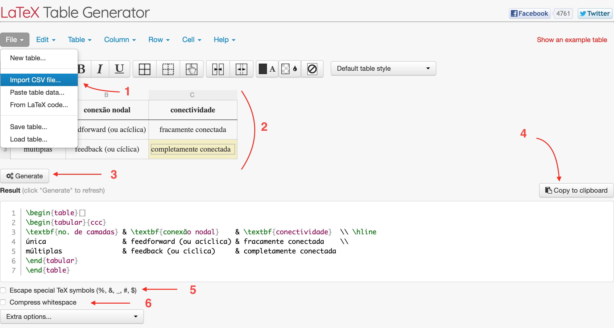

### TRABALHANDO NA SEÇÃO `CONCLUSÃO`...

##### Passo 28: Inserir tabela

- **Nota:** a inserção de tabelas na seção `Conclusão` de um artigo não é uma prática habitual nem recomendada. Neste tutorial, estamos apenas complementando a aprendizagem das capacidades do Latex. 

- Para inserir uma tabela, usamos o seguinte bloco de comandos

```latex
\begin{table}[h!]
\begin{tabular}{ccc}
\textbf{no. de camadas} & \textbf{conexão nodal}    & \textbf{conectividade}  \\ \hline
única                   & feedforward (ou acíclica) & fracamente conectada    \\
múltiplas               & feedback (ou cíclica)     & completamente conectada
\end{tabular}
\caption{\label{tab:resumo}Tabela-resumo dos tipos de arquitetura de RNAs.}
\end{table}
```
- Observe os elementos: 
	- `h!`: força a tabela a ser colocada nesta posição (aqui, _**h**ere_)
	- `{ccc}`: diz que a tabela possui 3 colunas cujas células terão alinhamento centralizado
		- Variações:
		
		|argumento|significado|
		|:---:|:---:|
		|`{l}`|uma coluna alinhada à esquerda (_left_)|
		|`{r}`|uma coluna alinhada à direita (_right_)|
		|`{lc}`|duas colunas; alinhamento: esquerda-centro|
		|`{ccr}`|três colunas; alinhamento: centro-centro-direita|
		|`{|c|cr}`|três colunas; alinhamento: centro-centro-direita com bordas na primeira coluna|
		|`{cc|r}`|três colunas; alinhamento: centro-centro-direita com borda à direita da segunda coluna|
		|`{|l|l|r|}`|três colunas; alinhamento: esquerda-esquerda-direita com bordas em todas as colunas|
		
- Separe colunas com `&`

- Adicione linhas com `\\`

- Adicione bordas horizontais com `\hline`

- Adicione legenda com `\caption` fora do ambiente `tabular` mas dentro do ambiente `table`.  

- Note que as linhas da tabela podem ficar muito justas. Aumente o espaçamento entre elas usando um fator de esticamento com `\arraystretch`.

```latex
\renewcommand{\arraystretch}{2.0}
``` 
- `\renewcommand` **sobrescreve** um comando definido com a sintaxe: `\renewcommand{comando}{valor}`

- `\newcommand` **define** um comando definido com a sintaxe: `\newcommand{comando}{valor}`

- Note que a largura da tabela pode extravazar a largura da coluna. Podemos controlar isto com o comando: 

```latex
\begin{table}[h!]
\resizebox{\columnwidth}{!}{
\begin{tabular}{ccc}
...
\end{tabular}
...
} % <--- fechamento de \resizebox
\end{table}
```
- Observe que `\resizebox` requer uma `}` de fechamento.

	
##### Passo 29: Construir uma tabela com `tablesgenerator.com`

- Mostraremos um _workflow_ útil para construir tabelas a partir de um arquivo `.csv` usando o site `tablesgenerator.com`. Observe a _screenshot_ abaixo:



1. Importe o arquivo `misc/archs.csv` para o site.
2. Formate a tabela usando os botões de formatação.
3. Gere a tabela. 
4. Copie o código resultante para a área de transferência
5. Desmarque a opção `Escape special TeX symbols` 
6. Idem para `Compress whitespaces`, sendo este opcional. 

- Cole o conteúdo no arquivo `.tex` do artigo.

##### Passo 30: Referenciar tabela no texto

- Tabelas podem ser referenciadas com `\ref{tab:nome}` da mesma maneira como fazemos para equações.