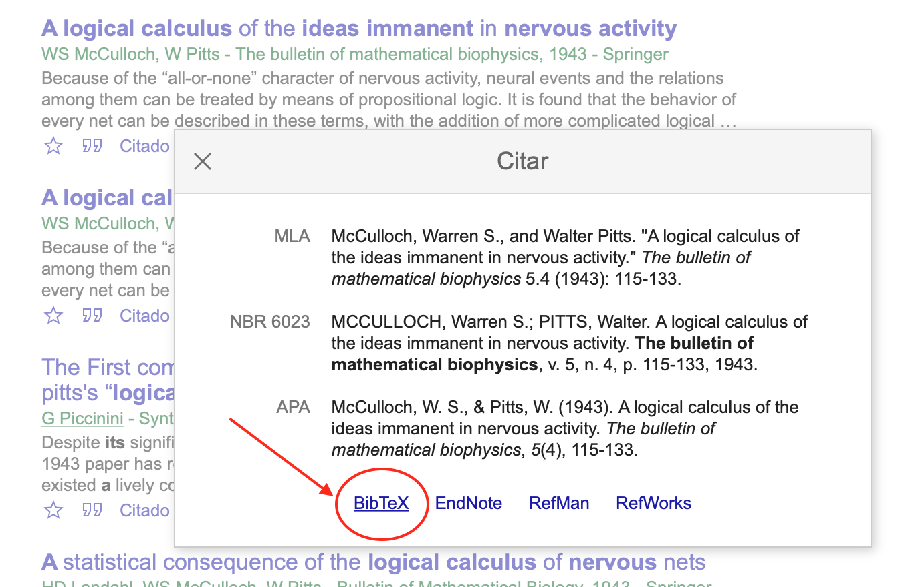

### ORGANIZANDO AS `REFERÊNCIAS BIBLIOGRÁFICAS`...

##### Passo 31: Inserir referências bibliográficas

- As referências podem ser postas uma a uma, caso queiramos, mas mostraremos uma maneira mais efetiva. O primeiro passo é estabelecer o estilo para a bibliografia. Em nosso modelo, usaremos o estilo IEEE

```latex
\bibliographystyle{IEEEtran}
\bibliography{IEEEabrv,refs}
``` 

- O bloco acima determina o estilo da bibliografia com `\bibliographystyle` e a forma como se abreviam as entradas com `\bibliography`. O argumento `refs` refere-se ao nome do arquivo de bibliografia que criamos anteriormente no **Passo 10** como `refs.bib`.

- A forma como alteramos o estilo pode ser feita com base no pacote `natbib`. Vide [Ajuda](https://pt.overleaf.com/learn/latex/Natbib_citation_styles#Further_reading).

##### Passo 32: Coletar referências com ajuda do `Google Acadêmico`

- Acesse o [Google Acadêmico](scholar.google.com.br)

1. Procure pelo nome da referência: _A logical calculus of the ideas immanent in nervous activity_
2. Escolha a referência que for mais relevante
3. Clique em `Citar`


- Acesse a entrada para os metados

1. Clique em `Bibtex`



- Copie os metadados do artigo

1. Selecione tudo 

2. Cole o texto no arquivo `refs.bib`

3. Repita o processo para todas as referências existentes no texto.
4. Recompile o arquivo para ver a seção de `Referências`

5. Verifique no `log`se todas as entradas foram corrigidas. Caso contrário, corrija-as. Você deve ver os links `[1]`, `[2]` e assim por diante. 


##### Passo 33: Criar nomes de referência consistentes

- Você pode acompanhar o padrão do Google ou criar o seu próprio, desde que o nome seja consistente com a entrada em `refs.bib`. 

```latex
\cite{mcculloch1943logical}
...
Saiba mais sobre RNAs em \cite{haykin1994neural}, 
\cite{braga2007} e \cite{kovacs2002redes}.
```
- No exemplo, note que: 

	- `mcculloch1943logical` aponta para um artigo
	- `haykin1994neural` aponta para um livro

- As entradas do arquivo `refs.bib` devem estar em conformidade com as entradas aceitáveis do formato `bibtex`. Vide [Gerenciamento de bibliografia em LaTeX](https://pt.overleaf.com/learn/latex/Bibliography_management_in_LaTeX#The_bibliography_file)

	- Entradas são precedidas por um `@`. 
		`@book`, `@article`
	- O bloco deve ser escrito entre `{...}` com a sintaxe `campo = "valor",` ou `campo = {valor},` com a `,` em todas as linhas, exceto no último campo.